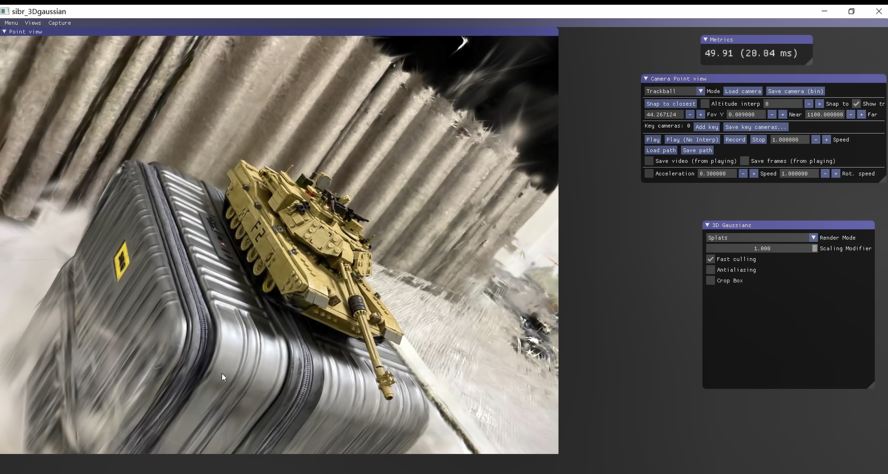

# AI-2025-3DGS

北京航空航天大学 - 2025 年秋季

《人工智能原理与应用》课程大作业（第 13 组）

------

## 简要介绍

本项目基于原始论文代码，在自己的采集数据集上成功复现了3D Gaussian Splatting的训练效果。

## 使用说明

### 环境配置

本项目在ubuntu环境中训练，使用RTX4090显卡训练

首先依据conda创建虚拟环境

```
cd gaussian-splatting
conda env create --file environment.yml
conda activate gaussian_splatting
```

然后运行train.py

```
python train.py -s <想要训练的数据集的目录>
```

本次作业训练的三个数据集存放在gaussian-splatting\dataset中，分别为qiushi，tanl，yellow

生成的模型在gaussian-splatting\output文件夹中

### 查看器安装

#### 在windows上查看

使用cmake处理依赖

```
cd gaussian-splatting\SIBR_viewers
cmake -Bbuild .
cmake --build build --target install --config RelWithDebInfo
```

#### 在ubuntu 22.04上查看

```
# 依赖
sudo apt install -y libglew-dev libassimp-dev libboost-all-dev libgtk-3-dev libopencv-dev libglfw3-dev libavdevice-dev libavcodec-dev libeigen3-dev libxxf86vm-dev libembree-dev
# 构建
cd gaussian-splatting\SIBR_viewers
cmake -Bbuild . -DCMAKE_BUILD_TYPE=Release # add -G Ninja to build faster
cmake --build build -j24 --target install
```

### 运行查看器

在 <SIBR安装目录>/bin 文件夹下，运行以下代码来打开SIBR

```
SIBR_gaussianViewer_app -m <训练好的模型目录>
```

## 结果展示


