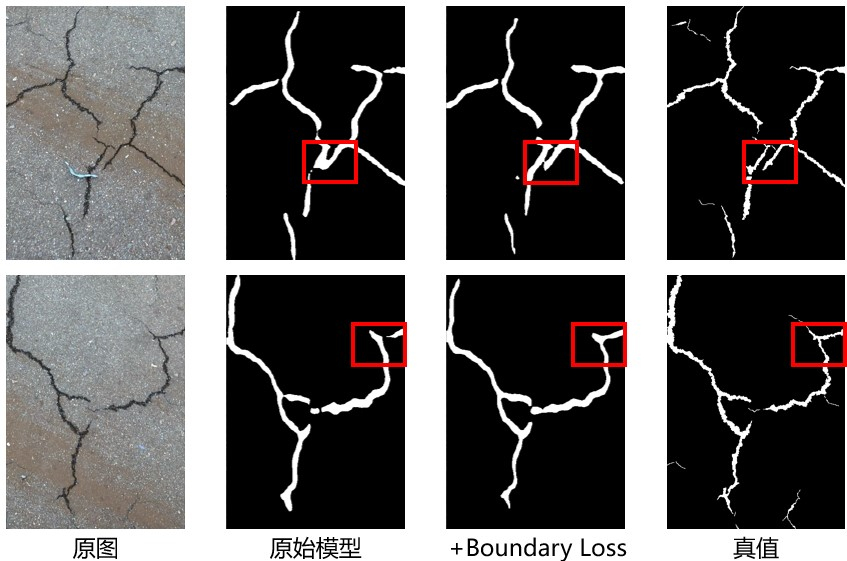
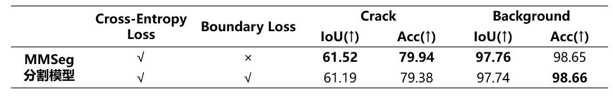

## Boundary Loss 模块说明

### 文件使用

1. `/new_projects`

此目录放置在 mmsegmentation 目录下。`/new_projects/deepcrack/configs` 下定义了使用 `boundary_loss` 和不使用 `boundary_loss` 的两种模型。

使用 `/new_projects/scripts/train_deepcrack.py` 或者 `mmsegmentation` 自带的训练脚本均可启动训练。

2. `boundary_loss.py`

此文件放置在 `mmsegmentation/mmseg/models/loss` 目录下，且需要按照 `mmsegmentation` 的规范注册到整个项目中。该文件定义了 `boundary_loss` 的计算公式，用于模型定义中。

### 效果展示

部分样本预测结果：

与基线模型对比结果：

