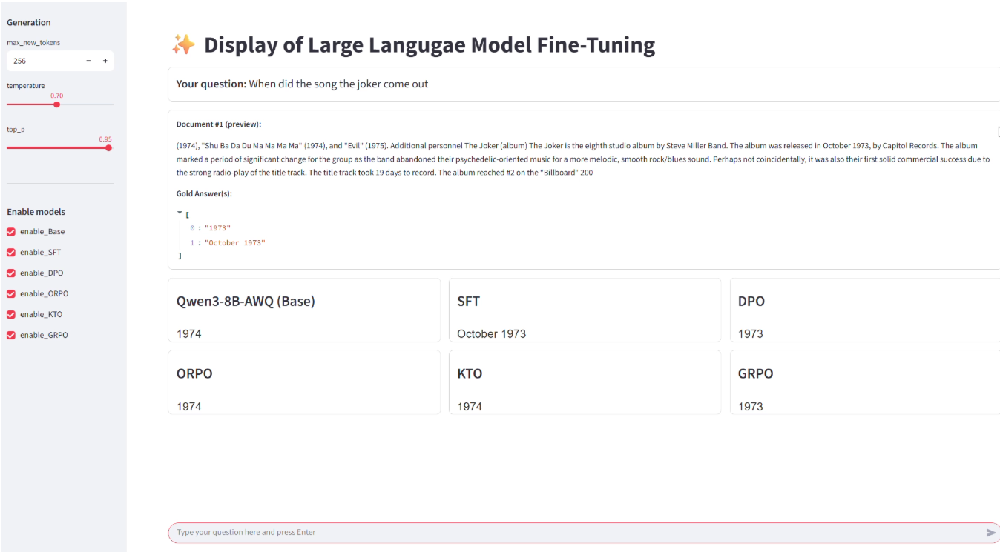

# AI2025- group09-大模型微调

本项目是《人工智能原理与应用》课程的大模型微调实验项目，基于 **Qwen3-8B-AWQ** 基准模型，通过LoRA微调方式进行监督微调（SFT）和偏好对齐类直接优化方法（DPO/ORPO/KTO/GRPO），从**SubEM**（子串精确匹配）和F1两个方面指标在**Natural Question**数据集上完成实验比较。项目基于Llama-Factory和peft+trl两种主流微调框架实现，并通过Streamlit实现模型推理的可视化。

## 📂仓库结构

```bash
group09/
├── DEMO/               # Streamlit脚本，展示页面
├── DPO/                # DPO算法实现，包括数据生成、训练和测试脚本
├── GRPO/               # GRPO算法训练脚本
├── KTO/                # KTO算法实现，包括负样本生成、数据清洗和测试脚本
├── ORPO/               # ORPO算法实现，包括训练和测试脚本
├── SFT/                # SFT，因为SFT使用Llama-Factory实现，仅给出数据处理相关
└── README.md           # 项目说明文档
```

## 🔧 使用说明

注意：本项目使用的基准模型是**Qwen3-8B-AWQ**，在实际使用中，推理占用现存约为6GB，LoRA微调（SFT）约为16GB。

### SFT

* 配置LLama_Factory环境，可以参考博客：https://blog.csdn.net/python12345678_/article/details/140346926

* 数据集，LLama_Factory支持两种数据格式，本项目的SFT部分采用alpaca格式，可使用/SFT/data_process/trans_alpaca.py进行转换，完成后需要在LLama_Factory文件中的data/data_info.json中注册需要用到的数据集，如下

```json
"nq_top5_train": {
	"file_name": "/LLaMAFactory/data/train_top5_alpaca.jsonl", #需要改成自己存放数据集jsonl的路径
	"columns": {
	"prompt": "instruction",
	"query": "input",
	"response": "output"
	}
},
"nq_top5_test": {
	"file_name": "/LLaMAFactory/data/test_top5_alpaca.jsonl", 
	"columns": {
	"prompt": "instruction",
	"query": "input",
	"response": "output"
	}
}
```

* 使用webui/cli进行SFT微调与测试，可选用Qwen3对话模板

### 偏好对齐

```bash
# 需要安装 peft和trl
cd DPO#（以DPO为例）

# 获取训练数据（DPO、KTO给出样本对生成）
python get_dpo_data

# 训练（需修改output_dir）
python train_dpo

# 测试（注：GRPO无脚本测试，项目采用LLama_Factory进行测试，通过SFT/data_process/trans_grpo.py生成grpo prompt的测试样本）
python inference --input "test.json"   --model "model/"
```

### Steamlit界面

```bash
cd DEMO

streamlit run streamlit_demo/main.py
```

## 📈 实验结果

### 主要实验

在选定的Natural Question问答数据集上进行实现所有方法的推理效果，指标为**SubEM**（子串精确匹配）和**F1**，**SubEM**为存在任一标准答案是预测答案的子串，该样本即判定为匹配成功，**F1**衡量预测答案与标准答案 token 的重叠程度。从结果上看，两个指标都是**DPO**达到了最优。

| **模型**       | **SubEM**  | **F1**     |
| -------------- | ---------- | ---------- |
| **base_model** | 0.4454     | 0.4107     |
| **SFT**        | 0.4942     | 0.4708     |
| **DPO**        | **0.5072** | **0.5150** |
| **GRPO**       | 0.4501     | 0.5045     |
| **ORPO**       | 0.3742     | 0.4180     |
| **KTO**        | 0.4548     | 0.4164     |

### 附加实验
**CoT推理实验**，使用与 **base_model** 预训练数据接近的 Qwen3-Max 模型在NQ数据集上进行数据收集，并以 F1=0.9 为阈值进行拒绝采样获得1300条推理正确的高质量CoT数据，用于SFT微调，与允许输出文本辅助的**base_model** 进行比较。

| **模型**           | **SubEM**  | **F1**     |
| ------------------ | ---------- | ---------- |
| **base_model_cot** | **0.4488** | 0.4254     |
| **SFT_cot**        | 0.4410     | **0.4339** |

微调后的模型在F1得分上相较于 base_model 有略微提升，SubEM略微下降，原因可能是基于高F1值选择的数据，未考虑 SubEM 值。提升较小应该是受合成的数据量不足的限制

**GRPO上的prompt和采样实验**，张子帅同学在实现了GRPO算法的基础上额外进行了不同Prompt、不同采样次数和不同超参数beta的对比，模型在Llama_factory中进行测试，结果如下。

| **模型**                     | **SubEM**  | **F1**     |
| ---------------------------- | ---------- | ---------- |
| **Prompt 1+采样4+beta 0**    | 0.4465     | 0.4485     |
| **Prompt 2+采样4+beta 0**    | 0.4429     | 0.5000     |
| **Prompt 2+采样8+beta 0**    | 0.4501     | **0.5045** |
| **Prompt 2+采样8+beta 0.02** | 0.4490     | 0.5024     |
| **Prompt 2+采样8+beta 0.04** | 0.4463     | 0.4818     |
| **Prompt 2+采样8+beta 0.08** | **0.4504** | 0.4904     |
| **Prompt 2+采样8+beta 0.1**  | 0.4476     | 0.4671     |

## 模型推理界面



## 👥 小组分工

**李乾志** SFT调参、模型测试

**石响** 	SFT数据生成和处理

**张谦驰** DPO训练、调参和测试

**张博豪** DPO数据采样和标注

**邓伟健** GRPO部分调研和报告

**张子帅** GRPO训练和实验

**梁智霖** ORPO训练和调试

**李衡**	模型展示页面制作

**谢卓然** KTO部分调研和报告

**周欣怡** KTO训练、调参和测试
